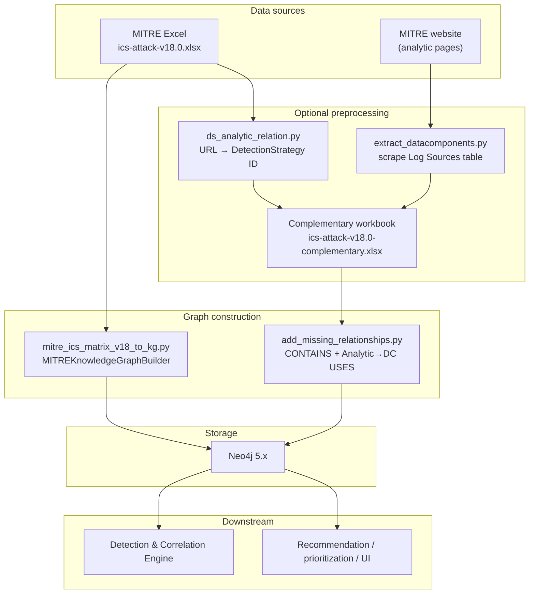
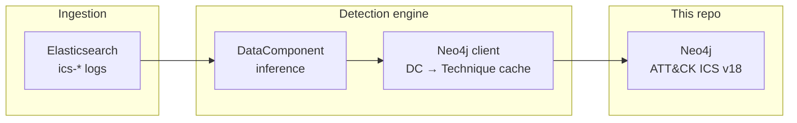

# MITRE ATT&CK for ICS Knowledge Graph

A reproducible **Extract–Transform–Load (ETL)** pipeline that materializes the [MITRE ATT&CK for ICS](https://attack.mitre.org/matrices/ics/) framework as a **labeled property graph** in **Neo4j**. The project ingests the official multi-sheet Excel export, applies optional enrichment for detection-chain edges missing from the spreadsheet, and produces a queryable graph suitable for security engineering, research, and integration with detection and recommendation systems.

---

## Table of contents

- [Overview](#overview)
- [Purpose and scope](#purpose-and-scope)
- [Architecture](#architecture)
- [Data model](#data-model)
- [How MITRE data is represented](#how-mitre-data-is-represented)
- [Requirements](#requirements)
- [Installation](#installation)
- [Data acquisition](#data-acquisition)
- [Build and populate the graph](#build-and-populate-the-graph)
- [Querying the graph](#querying-the-graph)
- [Integration with the detection engine and broader system](#integration-with-the-detection-engine-and-broader-system)
- [Project structure](#project-structure)
- [Further reading](#further-reading)
- [Limitations and security notes](#limitations-and-security-notes)

---

## Overview

Industrial control and OT environments benefit from a **structured, relationship-first** view of adversary behavior, mitigations, and detection guidance. This repository automates construction of that view from MITRE’s ICS matrix data (v17.1 legacy and **v18 primary**), storing entities and STIX-style relationships in Neo4j so you can run multi-hop Cypher queries (e.g. group → technique → mitigation, or detection strategy → analytic → data component).

**Highlights**

- **Neo4j v18 schema**: Techniques, tactics, mitigations, software, groups, campaigns, ICS assets, data components, analytics, and detection strategies with constraints and indexes on `id` and key `name` fields.
- **Official Excel as source of truth** for bulk nodes and relationships; **auxiliary scripts** derive detection-strategy ↔ analytic and analytic ↔ data-component links not fully expressed in the export.
- **Companion documentation**: deeper design notes, statistics, and examples live in [`docs/knowledge_graph_documentation.md`](docs/knowledge_graph_documentation.md).

---

## Purpose and scope

| In scope | Out of scope |
|----------|--------------|
| Loading ATT&CK for ICS from Excel into Neo4j | Real-time sync from MITRE TAXII/GitHub (manual refresh per release) |
| v18 graph build + optional complementary enrichment | Enterprise ATT&CK matrix (different dataset) |
| v17 builder for historical/legacy graphs | Hosted Neo4j operations (you provide the instance) |
| Cypher-oriented consumption by other components | STIX 2.1 JSON parsing (MITRE’s Excel is the interface here) |

The graph is intended as a **semantic backbone** for tooling that needs to answer: *Given a technique or data component, what mitigations, detection strategies, analytics, and threat context apply?*

---

## Architecture

End-to-end flow:



**Components**

1. **Primary builder** (`mitre_ics_matrix_v18_to_kg.py`): reads Excel sheets (`tactics`, `techniques`, `matrix`, `relationships`, …), creates constraints, `MERGE`s nodes and relationships, adds secondary indexes, logs statistics.
2. **Complementary enrichment** (`add_missing_relationships.py`): adds `DetectionStrategy -[:CONTAINS]-> Analytic` and `Analytic -[:USES]-> DataComponent` from a small companion workbook.
3. **Helpers**: `ds_analytic_relation.py` parses analytic URLs for parent detection strategy IDs; `extract_datacomponents.py` fetches analytic HTML and extracts data component IDs from the “Log Sources” table (rate-limited HTTP).

**Legacy**: `mitre_ics_matrix_v17_to_kg.py` targets the older **DataSource**-centric model and different relationship normalization; use only when you must reproduce v17 graphs.

---

## Data model

### Node labels (v18)

| Label | Role |
|-------|------|
| `Technique` | ATT&CK technique (e.g. `T0853`) |
| `Tactic` | Tactical goal; links to techniques via `USES` |
| `Mitigation` | Course-of-action style mitigation |
| `Software` | Malware or tool (`malware` / `tool` STIX types unified here) |
| `Group` | Threat group / intrusion set |
| `Campaign` | Campaign object |
| `Asset` | ICS-relevant asset types techniques may target |
| `DataComponent` | Observable data for detection (v18) |
| `Analytic` | Concrete analytic under a detection strategy |
| `DetectionStrategy` | MITRE detection strategy for a technique |

Uniqueness constraints are defined on `id` for each label; additional B-tree indexes exist on several `name` properties for lookup performance.

### Relationship types (representative)

Relationships are created from the `relationships` sheet (STIX `mapping type` normalized to uppercase with `-` / spaces → `_`) and from sheet-specific logic (e.g. matrix and technique rows).

| Pattern | Meaning |
|---------|---------|
| `(Tactic)-[:USES]->(Technique)` | Technique appears under that tactic (matrix / techniques sheet) |
| `(Mitigation)-[:MITIGATES]->(Technique)` | Mitigation applies to technique |
| `(DetectionStrategy)-[:DETECTS]->(Technique)` | Strategy documents detection for technique |
| `(Technique)-[:TARGETS]->(Asset)` | Technique targets asset type |
| `(Group\|Campaign\|Software)-[:USES]->(Technique\|Software)` | Adversary or tool use |
| `(Campaign)-[:ATTRIBUTED_TO]->(Group)` | Attribution |
| `(Group)-[:ASSOCIATED_WITH]->(Group)`, `(Campaign)-[:ASSOCIATED_WITH]->(Campaign)`, `(Asset)-[:RELATED_TO]->(Asset)` | Associations from list fields |
| `(DetectionStrategy)-[:CONTAINS]->(Analytic)` | **Enrichment** |
| `(Analytic)-[:USES]->(DataComponent)` | **Enrichment** (analytic requires DC) |

The v18 builder intentionally uses a **polymorphic** `USES` type for several semantics; disambiguate in Cypher by specifying source and target labels (e.g. `(Group)-[:USES]->(Software)` vs `(Analytic)-[:USES]->(DataComponent)`).

Approximate scale for v18 (see detailed tables in the docs): on the order of **~410 nodes** and **~1.4k+** relationships before enrichment; enrichment adds more `CONTAINS` and analytic→DC edges.

---

## How MITRE data is represented

- **Input format**: Microsoft Excel (`.xlsx`) exported from MITRE’s ATT&CK workbench / official releases—one worksheet per entity family plus `matrix` and `relationships`.
- **STIX column semantics**: Rows use ATT&CK-style columns (`ID`, `STIX ID`, `name`, `description`, `url`, timestamps, `domain`, `version`, etc.). The `relationships` sheet encodes directed edges: `source ID`, `source type`, `target ID`, `target type`, `mapping type`, optional `mapping description`.
- **Type mapping**: STIX types (e.g. `attack-pattern`, `course-of-action`, `x-mitre-data-component`) are mapped to Neo4j labels in `map_stix_type_to_label()` in the v18 builder.
- **Multi-valued fields**: Lists in cells (platforms, tactics, contributors, …) are parsed with comma/newline/semicolon splitting and stored as array properties where applicable.
- **Technique-centric extras**: Techniques may get `platforms`, `data_sources`, `contributors` as list properties on the node in addition to graph relationships.

---

## Requirements

- **Python** 3.10+ recommended (3.x as used in development)
- **Neo4j** 5.x (local Docker, self-hosted, or Aura; use `bolt://` or `neo4j+s://` as appropriate)
- **Python packages** (minimal pipeline): see [`requirements.txt`](requirements.txt) — `pandas`, `neo4j`, `openpyxl`

Optional helpers also need:

```text
requests
beautifulsoup4
```

Install them when running `extract_datacomponents.py`.

---

## Installation

```bash
git clone <this-repository-url>
cd MITRE-ATTACK-for-ICS-Knowledge-Graph
python -m venv .venv
source .venv/bin/activate   # Windows: .venv\Scripts\activate
pip install -r requirements.txt
pip install requests beautifulsoup4   # only if using the scraper
```

Start Neo4j and note the Bolt URI, username, and password.

---

## Data acquisition

1. Download the **ATT&CK for ICS** Excel bundle for your target version from MITRE (e.g. **v18.0** for the primary builder).
2. Place it under `input/`, e.g. `input/ics-attack-v18.0.xlsx`.
3. **Optional**: Build the complementary workbook used by `add_missing_relationships.py` (see [Build and populate the graph](#build-and-populate-the-graph)).

> **Note**: Large binary inputs are often gitignored; the `input/` layout is conventional—create the folder if it does not exist.

---

## Build and populate the graph

### 1. Configure credentials

The scripts use placeholders in `main()`:

- `mitre_ics_matrix_v18_to_kg.py`: `NEO4J_URI`, `NEO4J_USERNAME`, `NEO4J_PASSWORD`, `EXCEL_FILE`
- `add_missing_relationships.py`: same pattern + path to complementary Excel

**Production practice**: pass secrets via environment variables or a secret manager; avoid committing real passwords.

### 2. Run the primary builder (v18)

```bash
python mitre_ics_matrix_v18_to_kg.py
```

Behavior (see `MITREKnowledgeGraphBuilder.build_knowledge_graph`):

- Optionally **`MATCH (n) DETACH DELETE n`** when `clear_existing=True`
- Creates **constraints** on `id` per label
- Loads sheets in dependency order, then **matrix** and **relationships**
- Adds **name** indexes and prints **node/relationship counts** and pattern checks

Set `clear_existing=False` only if you intend incremental merges and understand orphan/duplicate risks.

### 3. (Recommended) Enrichment: detection strategy ↔ analytic ↔ data component

Official Excel does not fully encode:

- `DetectionStrategy -[:CONTAINS]-> Analytic`
- `Analytic -[:USES]-> DataComponent`

Generate data with:

```bash
# From analytic URLs in the main workbook — produces mapping Excel
python ds_analytic_relation.py

# Scrapes MITRE pages — slow, be respectful of rate limits
python extract_datacomponents.py
```

Then assemble **`input/ics-attack-v18.0-complementary.xlsx`** with exactly these sheets:

| Sheet name | Required columns |
|------------|------------------|
| `analytic_detectionstrategy` | `analytic_ID`, `detectionstrategy_ID` |
| `analytic_datacomponents` | `analytic_ID`, `datacomponent_IDs` (semicolon-separated IDs) |

**Sheet naming note:** The helper scripts default to different sheet titles (`analytic_detection_strategy`, `analytics_datacomponents`). Rename sheets (or copy columns) so they match the table above before running the adder.

```bash
python add_missing_relationships.py
```

### 4. v17 (legacy only)

```bash
python mitre_ics_matrix_v17_to_kg.py
```

Uses `DataSource` and different relationship naming; prefer v18 for alignment with current MITRE ICS detection objects and with downstream engines documented for v18.

---

## Querying the graph

Use **Neo4j Browser**, **cypher-shell**, or any Bolt client. Examples:

**Mitigations for a technique**

```cypher
MATCH (m:Mitigation)-[:MITIGATES]->(t:Technique {id: $tid})
RETURN m.id, m.name, m.description;
```

**Full detection chain (after enrichment)**

```cypher
MATCH (ds:DetectionStrategy)-[:DETECTS]->(t:Technique {id: $tid})
OPTIONAL MATCH (ds)-[:CONTAINS]->(a:Analytic)
OPTIONAL MATCH (a)-[:USES]->(dc:DataComponent)
RETURN ds.id, ds.name, a.id, a.name, collect(DISTINCT dc.id) AS data_components;
```

**Tactic coverage**

```cypher
MATCH (tac:Tactic {name: 'Initial Access'})-[:USES]->(tech:Technique)
RETURN tech.id, tech.name
ORDER BY tech.id;
```

**Threat group profile**

```cypher
MATCH (g:Group {id: $gid})
OPTIONAL MATCH (g)-[:USES]->(t:Technique)
OPTIONAL MATCH (g)-[:USES]->(s:Software)
RETURN g.name, collect(DISTINCT t.id) AS techniques, collect(DISTINCT s.name) AS software;
```

The builder’s `main()` logs similar samples after a successful run. More use cases appear in [`docs/knowledge_graph_documentation.md`](docs/knowledge_graph_documentation.md) (§12).

---

## Integration with the detection engine and broader system

This graph is designed to sit beside a **log-driven detection pipeline** and higher-level **recommendation or analytics** services:

| Consumer | Typical use |
|----------|-------------|
| **MITRE ATT&CK for ICS Detection and Correlation Engine** | Maps observed events to **DataComponents** (embeddings + Logstash enrichment), then uses Neo4j—when enabled—to traverse paths such as **DataComponent ← Analytic ← DetectionStrategy → Technique**, with fallback mappings if the graph is offline. |
| **Recommendation / prioritization** | Retrieves **MITIGATES**, **TARGETS**, group/campaign context for scoring and reporting. |
| **Analyst or SOAR workflows** | Explains alerts with tactic/technique/mitigation context and detection-strategy provenance. |

A concrete open-source integration path: deploy this repository’s Neo4j instance, load v18 data, then point the engine’s `neo4j.uri` / credentials at it (see the sibling project **MITRE-ATTACK-for-ICS-Detection-and-Correlation-Engine** README for schema expectations and cache warmup). Platforms such as **AegisRec** may surface Neo4j connectivity in dashboards and use graph-backed retrieval for mitigation or narrative layers—ensure the graph is loaded and reachable for those features to avoid empty retrieval paths.



---

## Project structure

```text
MITRE-ATTACK-for-ICS-Knowledge-Graph/
├── README.md                          # This file
├── requirements.txt                   # Core Python dependencies
├── mitre_ics_matrix_v18_to_kg.py      # Primary v18 Neo4j builder
├── mitre_ics_matrix_v17_to_kg.py      # Legacy v17 builder
├── add_missing_relationships.py       # Enrichment: CONTAINS + Analytic→DataComponent
├── ds_analytic_relation.py            # Derive DetectionStrategy IDs from analytic URLs
├── extract_datacomponents.py          # Scrape data components from analytic pages
├── docs/
│   └── knowledge_graph_documentation.md  # Extended architecture & query reference
├── input/                             # Place MITRE Excel files here (convention)
├── output/                            # Optional: intermediate mapping exports
└── terminal_output/                   # Example build logs (v17/v18)
```

---

## Further reading

- **Extended report-style documentation**: [`docs/knowledge_graph_documentation.md`](docs/knowledge_graph_documentation.md) — ETL details, schema tradeoffs, performance notes, limitations, and additional Cypher patterns.
- **MITRE ATT&CK for ICS**: https://attack.mitre.org/matrices/ics/
- **Neo4j Cypher**: https://neo4j.com/docs/cypher-manual/

---

## Limitations and security notes

- **Static snapshot**: Refresh the graph when MITRE publishes a new ICS release; there is no built-in auto-update.
- **Scraper fragility**: HTML layout changes on attack.mitre.org can break `extract_datacomponents.py`; re-validate after major site updates.
- **Build performance**: Row-by-row `session.run` calls favor clarity over bulk-load throughput; large deployments may adopt `UNWIND` batching (see future work in the docs).
- **Credentials**: Do not commit real Neo4j passwords; use environment variables or your platform’s secret store.
- **Statistics**: The v18 builder uses `CALL db.labels()` / `CALL db.relationshipTypes()` — **APOC is not required** for the summary statistics.

---

*MITRE ATT&CK® is a registered trademark of The MITRE Corporation. This project is not affiliated with or endorsed by MITRE; it is an independent tool for loading publicly released ATT&CK data into Neo4j.*
